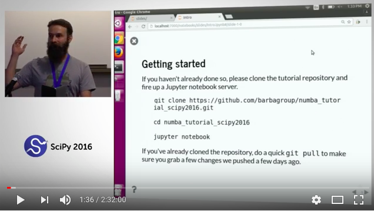

# Numba: Tell those C++ bullies to get lost 

This is the repository for the Scipy 2016 tutorial.  The tutorial will be presented as a set of Jupyter notebooks with exercises sprinkled throughout.

1. [Installation](#installation-instructions)
2. [Optional extras](#optional-extras)
3. [Check your installation](#check-installation)


# Installation Instructions

We _strongly_, *strongly*, __strongly__ encourage you to use `conda` to install the required packages for this tutorial.  There are non-Python dependencies required that make manual installation or installing with `pip` very involved.  

Note also that this tutorial is written for  Python 3.5.  Most things will still work on Python 3.4.  No guarantees of any kind are made that it will be compatible with Python 2.

## Regarding `matplotlib`

This tutorial uses the Viridis colormap pretty much everywhere we can use a colormap.  This colormap was first made available in matplotlib 1.5.0.  Please upgrade if you have an earlier version installed.

## Installing with `conda`

### Option a) Create a new environment
Download the `environment.yml` file in the root of this repository, e.g.

```console
wget https://raw.githubusercontent.com/barbagroup/numba_tutorial_scipy2016/master/environment.yml
```

and then create the environment with

```console
conda env create -f environment.yml
```

This will create a conda environment named `numbatutorial` with all of the required packages.

You can activate the environment with 

```console
source activate numbatutorial
```
or on Windows:

```console
activate numbatutorial
```

### Option b) Install the required packages 

```console
conda install jupyter ipython numpy numba line_profiler matplotlib
```

```console
pip install line_profiler
```

**Note**: Do not use `conda` to install `line_profiler`; the version available in `conda` default channels is out of date.


## Installing with `pip`

To install (specifically) Numba using `pip`, you need to have LLVM 3.7 installed on your machine with both libraries and header files.  

### Prerequisites

#### Ubuntu / Debian

You should be able to do a 

```console
sudo apt-get install llvm-3.7-dev
```

You may also need to install `libedit-dev`

#### Windows 
You can follow instructions here for getting LLVM installed on Windows.

http://llvm.org/docs/GettingStartedVS.html

#### OSX

Install XCode which includes LLVM

### Install `llvmlite`

If your `llvm-config` (or `llvm-config.exe`) file is in a non-standard location, set the `LLVM_CONFIG` environment variable to point at the `llvm-config` binary.  

Then

```console
pip install llvmlite
```

If that installed successfully then you can continue to install the rest of the dependencies (which are must less fussy)

### Install everything else

```console
pip install numpy matplotlib jupyter ipython numba line_profiler 
```

or 

```console
pip install -r requirements.txt
```

# Optional extras

No hands-on work requires these, but if you want to play with some of the examples.  If you installed using either `environments.yml` or `requirements.txt` these are already installed.

```console
conda install cython dask
```

```console
pip install cython dask
```

We recommend you also install the Jupyter notebook extensions.  

```console
pip install https://github.com/ipython-contrib/IPython-notebook-extensions/archive/master.zip --user
```

Once they are installed, start a notebook server 

```console
jupyter notebook
```

and (assuming port 8888) navigate to `http://localhost:8888/nbextensions` where you can choose which extensions to enable.  One that is helpful (for us!) when using Numba in the notebook is the `Skip-Traceback` extension.  You're welcome to enable whichever extensions you like (we're also fans of `Codefolding` and the `Comment/Uncomment Hotkey`).

# Check Installation

Once you have downloaded all of the requires libraries/packages, you can run the `check_install.py` script to confirm that everything is working as expected.  Either download the file directly or clone this repository and then run

```console
python check_install.py
```

# Video of the live tutorial

Check out the video of the live tutorial at SciPy 2016 (filmed Monday 11 July).

[](https://youtu.be/SzBi3xdEF2Y)
